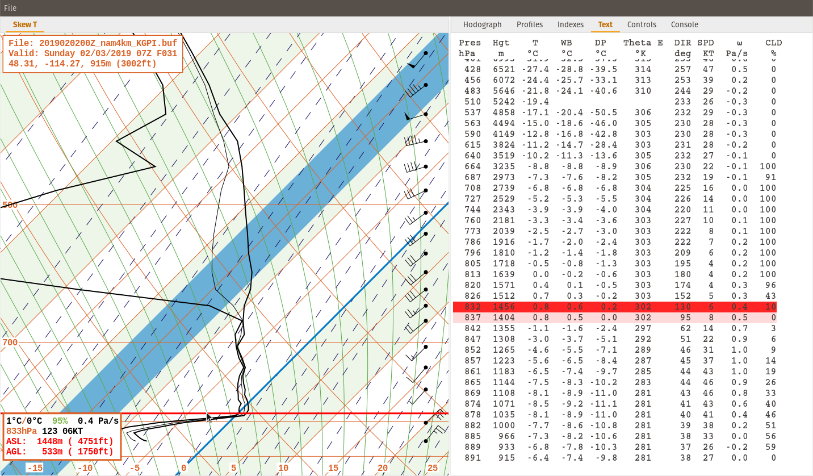
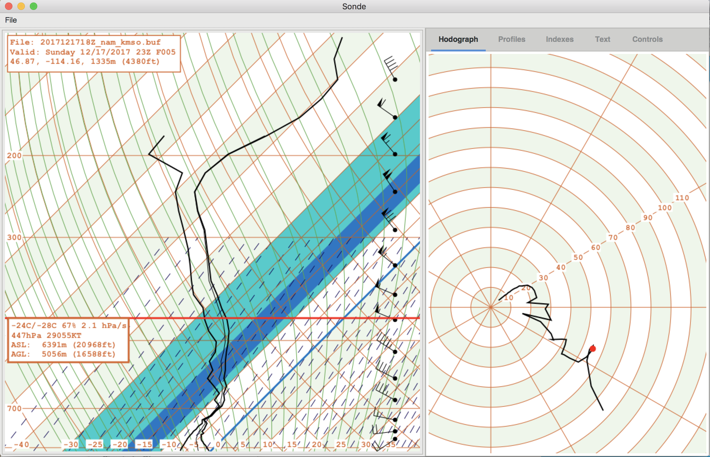
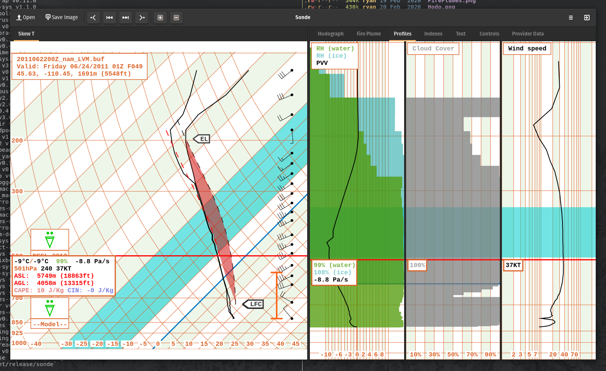
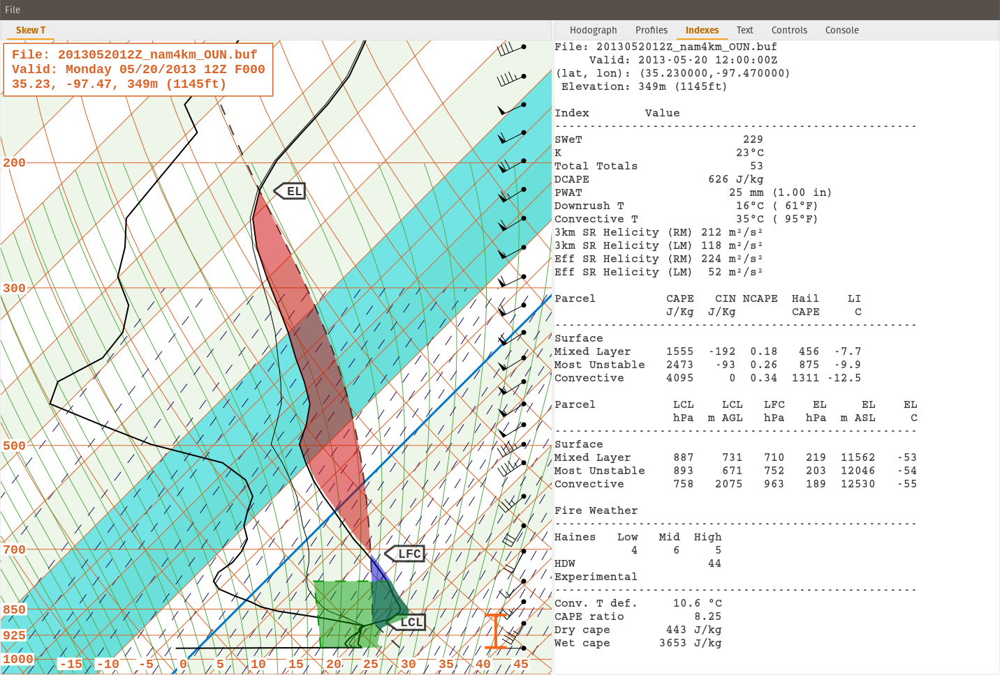
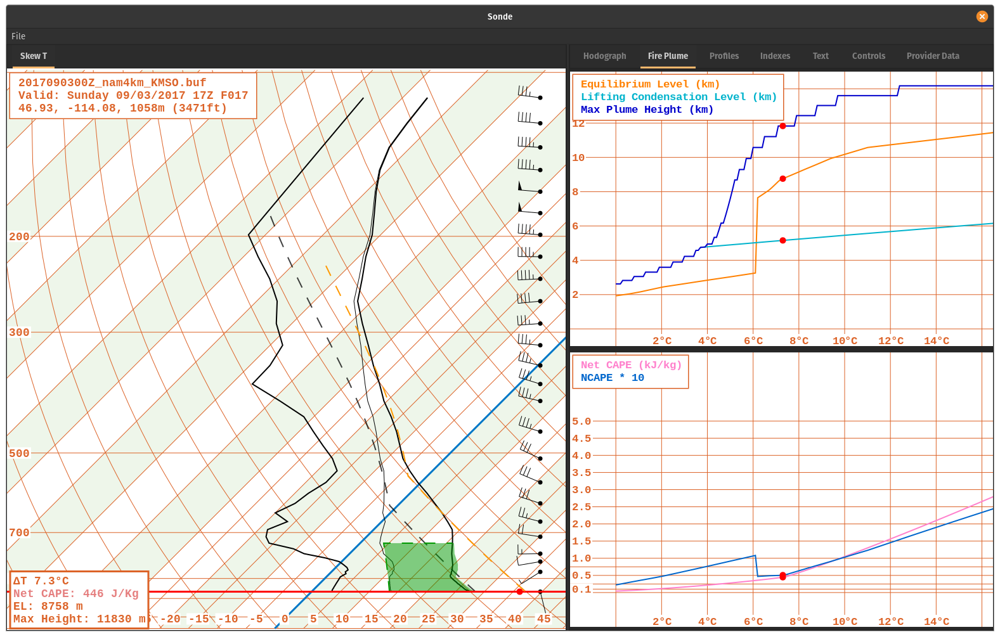

# Sonde
A program for viewing and analysis of atmospheric soundings.

## Background

There are already a few good tools out there for looking at atmospheric sounding data including
[Bufkit][bufkit] and [SHARPpy][sharppy]. I'm doing this because I enjoy meteorology and coding and 
this is a good way to explore both in depth.

I used [GKT+][gtk] via [Gtk-rs][gtkrs] and [Rust][rust] to implement it.

Probably the most frequently thought of use case for sounding analysis is thunderstorms and 
convection. However, they are also used heavily in forecasting winds and precipitation type during 
the winter. My main interests in meteorology are fire weather and winter weather, so that is the 
emphasis I am taking as I develop this. Of course convection will be considered too, but it is not 
my top priority.

## Features
 - Data views
   - Pan and zoom. All data displays (except text) support panning and zooming.
   - Consistent graphical representation. No matter how far you zoom in/out on the skew-t, the 
     coordinates always keep the same aspect ratio. So a given lapse rate will always have the same
     slope in the image, no matter to what scale you zoom. 
 - Background
   - Standard skew-t log-p background lines including constant mixing ratio, isotherms, isobars,
     moist adiabats and dry adiabats.
   - Optional shading change every 10 degrees.
   - Critical temperature zones highlighted including hail growth zone and dendritic snow growth
     zone.
   - Freezing line/level emphasized.
   - Showing, hiding, and colors of all lines and shading is configurable.
 - Profiles
   - Pressure vertical velocity overlaid with relative humidity, and relative humidity with respect
     to ice can be shown along with the typical humidity over water.
   - Wind speed.
   - Cloud cover.
 - Profile backgrounds.
   - Highlights dendritic snow growth and hail growth zones if present in the sounding.
   - Highlights warm layers aloft (dry bulb and wet bulb) if the surface temperature is below 
     freezing.
   - Freezing level emphasized.
   - Showing, hiding, and colors of all lines and shading is configurable.
 - Data
   - Wet bulb plot added.
   - Progressive disclosure of winds.
   - Sample readout synchronized across views (skew-t, hodograph, text, profiles).
   - Showing, hiding, and colors of all data types is configurable.
 - Analysis
   - Convective parcel analysis is drawn using virtual temperature. This is the most appropriate for
     CAPE/CIN calculations.
   - DCAPE/Down rush profiles are drawn and the area is shaded, using virtual temperature.
   - Inversion mix downs can be drawn.
   - Sample readout shows the currently sampled parcel profile and dry adiabatic mix down, including
     the CAPE and CIN values for the sampled parcel.
   - Convective parcel analysis has five parcels to choose from: surface, mixed layer, most unstable
     convective, and effective.
   - The effective inflow layer is plotted next to the wind barbs on the skew-t.
   - In the hodograph display the 0-6 km mean wind, right moving, and left moving super cell motions
     are also plotted.
   - In the hodograph the 0-3 km Helicity or effective inflow layer helicity can be plotted with 
     respect to the right mover OR left mover storm motion.
   - Most analysis options are configurable via a right click menu in the sounding and hodograph 
     areas.
   - The indexes tab lists several common and some uncommon indexes and parcel analysis values for
     thunderstorms and fire weather. Some of the fire weather parameters are experimental and may
     change frequently with updates.
 - Data sources
   - Supports loading Bufkit files (*.buf), which are available from [Bufkit warehouse][warehouse],
     some U.S. National Weather Service Office sites, and [Penn State][psu download].
   - Supports loading some [bufr][bufr] files if you can find them.
   - Supports loading HTML files loaded from the [University of Wyoming][uwyo] website as 
     "Text: List". Just load the webpage for the sounding you want and then save it as HTML, then
     open that file in Sonde.
 - Configuration
   - Controls tab allows configuration of what data, background lines, and background shading are 
     displayed. Almost all the colors used are configurable too. It is very much a work in progress.
   - Persistence from run to run has been implemented via a config.yml file that is saved every time
     the program shuts down.
   - Right click menu on the sounding to choose parcel type (surface, mixed layer, most unstable, 
     convective) for parcel analysis and many other data display options.
   - Supports saving and loading configurations (as themes) from YAML files.

## Screenshots

The text view prints out a raw text depiction of the sounding data. This is not necessarily the
same as was in the original data file, since that may cover several soundings and have information
spread out in many disconnected areas.  

When you sample from the skew-t, the values shown in the active readout are linearly interpolated 
between data points in the original file. The text view highlights the two points used for that
interpolation and shades according to the weight each had in the interpolated value.

A hodograph is also included. When sampling the skew-t, a dot appears at the corresponding location
on the hodograph. Mean wind, storm motion, and storm relative helicity are also plotted.

The profiles highlight important levels, such as the dendritic snow growth zone or the hail growth
zone. A recent addition was also the precipitation icons, where the precipitation type is 
determined by the model, the Bourgoin technique, or the Top Down method (NSSL). Intensity
(Light, Moderate, Heavy) and mode (Stratiform, Convective) are determined from the precipitation
and convective precipitation amounts if they are included in the bufkit files. Also, the sample
readouts track directly with the one on the skew-t.

The indexes contain several common and some uncommon values from parcel theory and fire weather. I
decided to include the helicity calculations for both the right and left moving supercell motions as
well as some experimental fire weather indexes.

Some experimental analysis techniques for analyzing the atmospheric stability related to wildfire
plumes are also included. 

[bufkit]:http://training.weather.gov/wdtd/tools/BUFKIT/index.php
[sharppy]:https://github.com/sharppy/SHARPpy
[gtk]:https://www.gtk.org/
[gtkrs]:http://gtk-rs.org/
[rust]:https://www.rust-lang.org/en-US/
[warehouse]:http://www.meteor.iastate.edu/~ckarsten/bufkit/data/
[psu download]:http://www.meteo.psu.edu/bufkit/CONUS_NAM_12.html
[uwyo]:http://weather.uwyo.edu/upperair/sounding.html
[bufr]:https://www.wmo.int/pages/prog/www/WDM/Guides/Guide-binary-1A.html
[issues]:https://github.com/rnleach/sonde/issues
